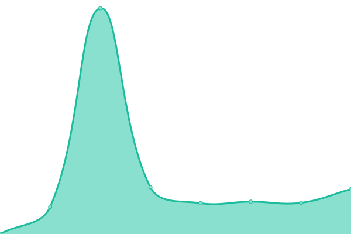

# [📈 Live Status](https://SamuraiSyntax.github.io/Upptime-AllBranches): <!--live status--> **🟩 All systems operational**

This repository contains the open-source uptime monitor and status page for [SamuraiSyntax](https://SamuraiSyntax.github.io/Upptime-AllBranches), powered by [Upptime](https://github.com/upptime/upptime).

With [Upptime](https://upptime.js.org), you can get your own unlimited and free uptime monitor and status page, powered entirely by a GitHub repository. We use [Issues](https://github.com/SamuraiSyntax/Upptime-AllBranches/issues) as incident reports, [Actions](https://github.com/SamuraiSyntax/Upptime-AllBranches/actions) as uptime monitors, and [Pages](https://SamuraiSyntax.github.io/Upptime-AllBranches) for the status page.

<!--start: status pages-->
<!-- This summary is generated by Upptime (https://github.com/upptime/upptime) -->
<!-- Do not edit this manually, your changes will be overwritten -->
<!-- prettier-ignore -->
| URL | Status | History | Response Time | Uptime |
| --- | ------ | ------- | ------------- | ------ |
|  [DEV NANARD](https://www.dev-nanard.fr) | 🟩 Up | [dev-nanard.yml](https://github.com/SamuraiSyntax/Upptime-AllBranches/commits/HEAD/history/dev-nanard.yml) | 

 1140ms
     
 | 

<a href="https://SamuraiSyntax.github.io/Upptime-AllBranches/history/dev-nanard">100.00%</a>
    

|  [PORTFOLIO ÉTUDE DEV NANARD](https://www.wp.dev-nanard.fr) | 🟩 Up | [portfolio-etude-dev-nanard.yml](https://github.com/SamuraiSyntax/Upptime-AllBranches/commits/HEAD/history/portfolio-etude-dev-nanard.yml) | 

 1056ms
     
 | 

<a href="https://SamuraiSyntax.github.io/Upptime-AllBranches/history/portfolio-etude-dev-nanard">100.00%</a>
    

|  [ENTREPRISE FERRER](https://www.travauxef.fr) | 🟩 Up | [entreprise-ferrer.yml](https://github.com/SamuraiSyntax/Upptime-AllBranches/commits/HEAD/history/entreprise-ferrer.yml) | 

 1197ms
     
 | 

<a href="https://SamuraiSyntax.github.io/Upptime-AllBranches/history/entreprise-ferrer">100.00%</a>
    

|  [ATELIER PEINTURE FERRER](https://www.peinture.travauxef.fr) | 🟩 Up | [atelier-peinture-ferrer.yml](https://github.com/SamuraiSyntax/Upptime-AllBranches/commits/HEAD/history/atelier-peinture-ferrer.yml) | 

 796ms
     
 | 

<a href="https://SamuraiSyntax.github.io/Upptime-AllBranches/history/atelier-peinture-ferrer">33.96%</a>
    

<!--end: status pages-->

[**Visit our status website →**](https://SamuraiSyntax.github.io/Upptime-AllBranches)

## 📄 License

- Powered by: [Upptime](https://github.com/upptime/upptime)
- Code: [MIT](./LICENSE) © [Anand Chowdhary](https://anandchowdhary.com), supported by [Pabio](https://pabio.com)
- Data in the `./history` directory: [Open Database License](https://opendatacommons.org/licenses/odbl/1-0/)
